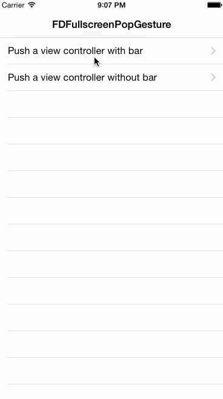

# FDFullscreen_Xamarin
[](http://cocoadocs.org/docsets/FDFullscreenPopGesture)

Port to Xamarin.iOS of the [FDFullscreenPopGesture](https://github.com/forkingdog/FDFullscreenPopGesture).

An UINavigationController's category to enable fullscreen pop gesture in an iOS7+ system style with AOP.

## NuGet
* [Xamarin.iOS.FDFullscreenPopGesture](https://www.nuget.org/packages/Xamarin.iOS.FDFullscreenPopGesture) [](https://www.nuget.org/packages/Xamarin.iOS.FDFullscreenPopGesture)

## Overview


## Usage

**AOP**, just add project reference and **no need** for any setups, all navigation controllers will be able to use fullscreen pop gesture automatically.  

To disable this pop gesture of a navigation controller:  

``` C#
navigationController.Fd_fullscreenPopGestureRecognizer().Enabled = false;
```

To disable this pop gesture of a view controller:  

``` C#
viewController.SetFd_interactivePopDisabled(true);
```

Require at least iOS **7.0**.

## View Controller Based Navigation Bar Appearance

It handles navigation bar transition properly when using fullscreen gesture to push or pop a view controller:  

- with bar -> without bar
- without bar -> with bar
- without bar -> without bar



This opmiziation is enabled by default, from now on you don't need to call **UINavigationController**'s `-setNavigationBarHidden:animated:` method, instead, use view controller's specific API to hide its bar:  

``` C#
public override void ViewDidLoad()
{
    base.ViewDidLoad();
    this.SetFd_prefersNavigationBarHidden(true);
}
```
And this property is **false** by default.

## License
MIT