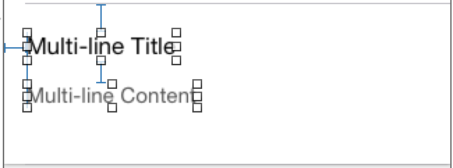
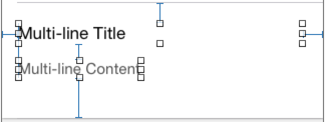

# FDTemplateLayoutCell_Xamarin

[](http://cocoadocs.org/docsets/UITableView+FDTemplateLayoutCell )

Port to Xamarin.iOS of the [FDTemplateLayoutCell](https://github.com/forkingdog/UITableView-FDTemplateLayoutCell).

Template auto layout cell for automatically UITableViewCell height calculating.

## NuGet
* [Xamarin.iOS.FDTemplateLayoutCell](https://www.nuget.org/packages/Xamarin.iOS.FDTemplateLayoutCell/) [](https://www.nuget.org/packages/Xamarin.iOS.FDTemplateLayoutCell/)

## Overview


## Usage

### Basic usage

If you have a self-satisfied cell, then all you have to do is:

```
public override nfloat GetHeightForRow(UITableView tableView, NSIndexPath indexPath)
        {
            return this.TableView.Fd_heightForCellWithIdentifier("reuse identifer", (cell)=>{
                // Configure this cell with data, same as what you've done in "-tableView:cellForRowAtIndexPath:"
                // Like:
                // cell.entity = self.feedEntities[indexPath.row];
            });
        }
```

### Height Caching API

Since iOS8, -tableView:heightForRowAtIndexPath: will be called more times than we expect, we can feel these extra calculations when scrolling. So we provide another API with cache by index path:

```
public override nfloat GetHeightForRow(UITableView tableView, NSIndexPath indexPath)
        {
            return this.TableView.Fd_heightForCellWithIdentifier("identifer", indexPath, (cell)=>{
                // configurations
            });
        }
```
Or, if your entity has an unique identifier, use cache by key API:
```
public override nfloat GetHeightForRow(UITableView tableView, NSIndexPath indexPath)
        {
            return this.TableView.Fd_heightForCellWithIdentifier("identifer", "unique id", (cell)=>{
                // configurations   
            });
        }
```

### Frame layout mode

`FDTemplateLayoutCell` offers 2 modes for asking cell's height.  

1. Auto layout mode using *SystemLayoutSizeFittingSize*
2. Frame layout mode using *SizeThatFits* 

Generally, no need to care about modes, it will **automatically** choose a proper mode by whether you have set auto layout constrants on cell's content view. If you want to enforce frame layout mode, enable this property in your cell's configuration block:  

``` C#
cell.SetFd_enforceFrameLayout(true);
```
And if you're using frame layout mode, you must override `-sizeThatFits:` in your customized cell and return content view's height (separator excluded)

``` C#
public override CGSize SizeThatFits(CGSize size)
{
    return base.SizeThatFits(size);
}
```

### Debug log

Debug log helps to debug or inspect what is this "FDTemplateLayoutCell" extention doing, turning on to print logs when "calculating", "precaching" or "hitting cache".Default to "NO", log by "NSLog".

``` C#
this.TableView.SetFd_debugLogEnabled(true);
```

It will print like this:  

``` c#
** FDTemplateLayoutCell ** layout cell created - FDFeedCell
** FDTemplateLayoutCell ** calculate - [0:0] 233.5
** FDTemplateLayoutCell ** calculate - [0:1] 155.5
** FDTemplateLayoutCell ** calculate - [0:2] 258
** FDTemplateLayoutCell ** calculate - [0:3] 284
** FDTemplateLayoutCell ** precached - [0:3] 284
** FDTemplateLayoutCell ** calculate - [0:4] 278.5
** FDTemplateLayoutCell ** precached - [0:4] 278.5
** FDTemplateLayoutCell ** hit cache - [0:3] 284
** FDTemplateLayoutCell ** hit cache - [0:4] 278.5
** FDTemplateLayoutCell ** hit cache - [0:5] 156
** FDTemplateLayoutCell ** hit cache - [0:6] 165
```

### About self-satisfied cell

a fully **self-satisfied** cell is constrainted by auto layout and each edge("top", "left", "bottom", "right") has at least one layout constraint against it. It's the same concept introduced as "self-sizing cell" in iOS8 using auto layout.

A bad one :( - missing right and bottom

   

A good one :)  

   

### Notes

A template layout cell is created by `DequeueReusableCell` method, it means that you MUST have registered this cell reuse identifier by one of:  

- A prototype cell of UITableView in storyboard.
- Use `RegisterClassForCellReuse()` 
- Use `RegisterNibForCellReuse()`

## License
MIT
