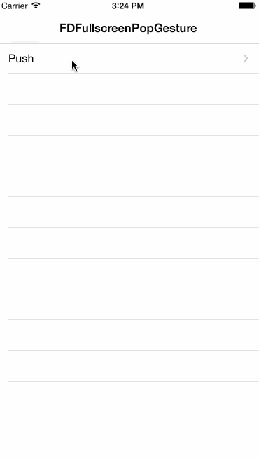

# FDFullscreen_Xamarin

Port to Xamarin.iOS of the [FDFullscreenPopGesture](https://github.com/forkingdog/FDFullscreenPopGesture).

An UINavigationController's category to enable fullscreen pop gesture in an iOS7+ system style with AOP.

## NuGet
* [Xamarin.iOS.FDFullscreenPopGesture](https://www.nuget.org/packages/Xamarin.iOS.FDFullscreenPopGesture) 

## Overview

## Details

[FDFullscreen_Xamarin Sample Project](https://github.com/Wenfengcheng/FDFullscreen_Xamarin/tree/master/FDFullscreen)

# FDTemplateLayoutCell_Xamarin

Port to Xamarin.iOS of the [FDTemplateLayoutCell](https://github.com/forkingdog/UITableView-FDTemplateLayoutCell).

Template auto layout cell for automatically UITableViewCell height calculating.

## NuGet
* [Xamarin.iOS.FDTemplateLayoutCell](https://www.nuget.org/packages/Xamarin.iOS.FDTemplateLayoutCell/) 

## Overview

## Details

[FDTemplateLayoutCell_Xamarin Sample Project](https://github.com/Wenfengcheng/FDFullscreen_Xamarin/tree/master/FDTemplateLayoutCell)
